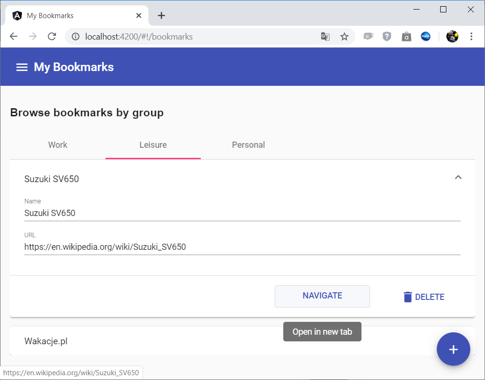
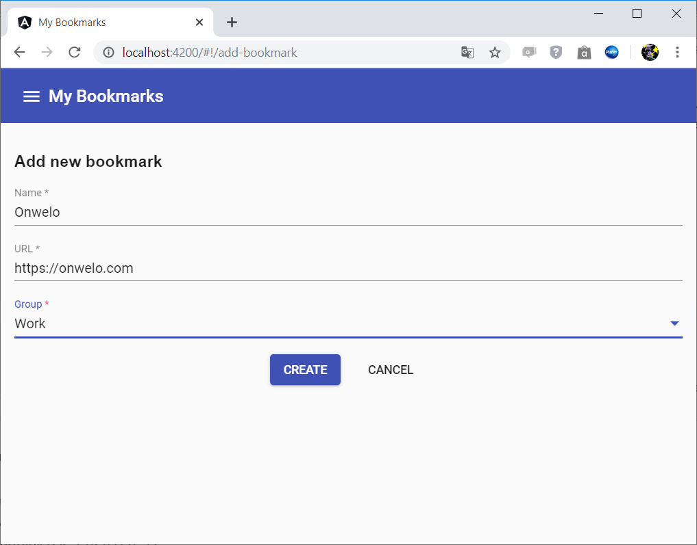
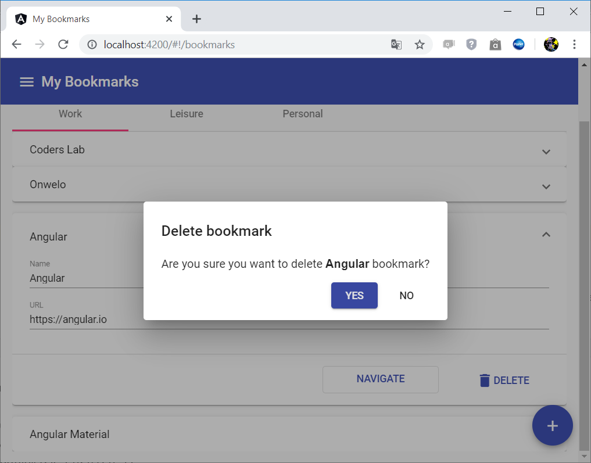

# NgrxMaterial

This project was generated with [Angular CLI](https://github.com/angular/angular-cli) version 8.3.17.

The app is a simple showcase of Angular 8 + Angular Material + NgRx.

## Description

The app uses NgRx store to manage the in-memory collection of browser bookmarks.
The initial data is hardcoded and the collection is not persisted anywhere.
The groups are contained in a fixed `enum` but can be reworked to a collection manageable by the app store.

### Modules

- `app.module.ts` - the main app module, contains all the necessary wiring for the app to run,
- `routing.module.ts` - contains router configuration,
- `library-imports.module.ts` - contains `imports` and `exports` statements of all external modules used in the app
(coming from Angular itself, Material and NgRx).

### Components

- `navbar`,
- `bookmark-list`,
- `bookmark-details`,
- `add-bookmark`,
- `confirmation-dialog`.

### Services

- `bookmarksService` - a facade that interacts with NgRx store: dispatches `create`/`delete` events and retrieves
(selects) the bookmarks.

## Features

### Browse bookmarks grouped by the "Group" property

### Add bookmarks

### Remove bookmarks

## Running the app

Run `ng serve` for a dev server. Navigate to `http://localhost:4200/`. The app will automatically reload if you change any of the source files.

## Build

Run `ng build` to build the project. The build artifacts will be stored in the `dist/` directory. Use the `--prod` flag for a production build.

## Running unit tests

Run `ng test` to execute the unit tests via [Karma](https://karma-runner.github.io).

Currently there are no unit tests other than those automatically created by the code generator.
